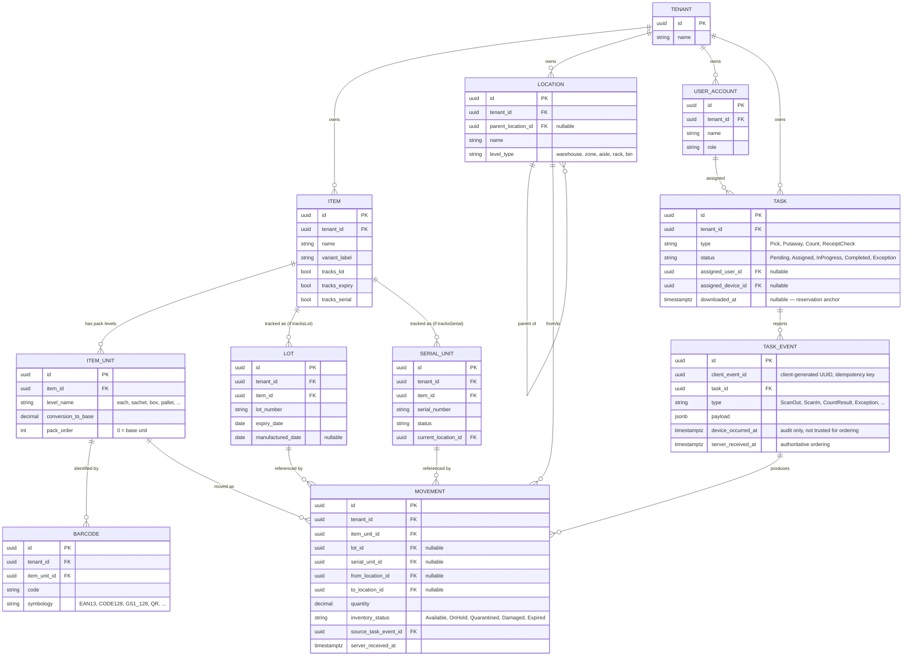

# Domain Model (v1)

This is the initial entity design implied by [architecture.md](architecture.md). It's a starting point for scaffolding, not a frozen schema — expect it to be refined once implementation starts. See [glossary.md](glossary.md) for term definitions.

## Design principles behind this shape

1. **Barcode is a lookup, not an identifier.** The same barcode can legitimately map to more than one thing (shared EAN across variants, reused codes across pack levels). `Item`/`ItemUnit`/`Barcode` are three separate entities so ambiguity is representable instead of forcing a false 1:1.
2. **Industry differences are flags on `Item`, not different schemas.** No `PharmaItem` / `ElectronicsItem` split — see [architecture.md](architecture.md#product-modeling-generic-core-no-per-industry-schema) for why.
3. **Stock balance is derived, never stored as a directly-mutated counter.** `Movement` is an append-only ledger; on-hand quantity per bin/lot is a query over it. This is what makes the offline sync model (see [sync-protocol.md](sync-protocol.md)) tractable — the backend applies deltas, it never merges two conflicting snapshots.
4. **Every tenant-owned table carries `tenant_id`**, enforced by both an EF Core global query filter and a Postgres RLS policy.

## Entity overview

## Notes on specific entities

- **`ItemUnit.pack_order`**: `0` is always the base (stock-keeping) unit; higher numbers are larger packs. Depth is per-item, not fixed — a tenant might have only `each`/`box`, another `each`/`sachet`/`box`/`pallet`.
- **`Barcode` is deliberately not unique** on `(tenant_id, code)`. Resolving an ambiguous scan (same code → multiple `ItemUnit`s) is application logic: narrow by the active Task's expected items first, then prompt the operator.
- **`Lot` and `SerialUnit` are optional bolt-ons**, populated only for items with the corresponding flag set. A tenant that never uses lot tracking has zero rows in `Lot` — no schema difference, no dead columns.
- **`Task.downloaded_at`** is the reservation anchor: stock relevant to a `PickTask` is soft-reserved at the moment the task is downloaded to a device (`SELECT ... FOR UPDATE SKIP LOCKED`), not when the task is created — this is what lets multiple PDTs work the same warehouse concurrently without double-allocating the same stock.
- **`TaskEvent.client_event_id`** is how sync is idempotent: replaying a sync batch (e.g. after a dropped connection mid-upload) is safe because the backend has already recorded that event ID.
- **`Movement` has no `quantity_after` or running balance column.** On-hand stock is always computed by summing `Movement` rows for a given `item_unit`/`lot`/`location` — this is what avoids merge-conflict logic entirely; the backend only ever appends.

## Open modeling questions

Not yet decided — flag before implementing the affected area:

- Exact `Location` hierarchy depth/labels: fixed 5-level (warehouse/zone/aisle/rack/bin) or fully tenant-configurable?
- Whether `SerialUnit.status` needs its own state machine beyond reusing `InventoryStatus`.
- UoM: are fractional/decimal quantities and catch-weight items in scope for v1, or integer-only?
